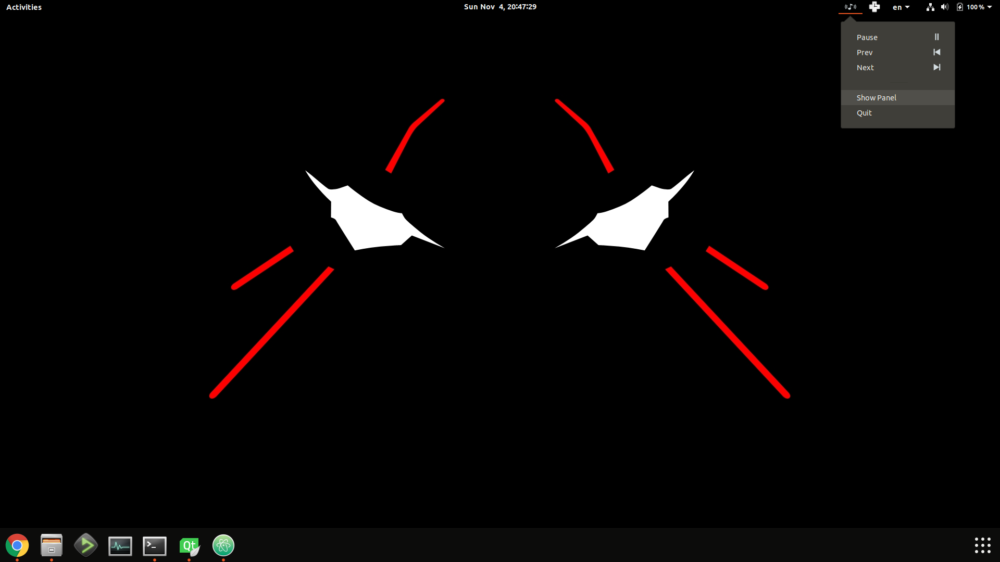

# Music Player

This is a project on Ubuntu using Qt 5.11.1, aiming at developing a light music player on Ubuntu.

## Qt Version

- Qt 5.11.1 (GCC 5.3.1, 64 bit)  
- QtCreator 4.6.2

## Usage

This application will read files from `~/Music/Playlist`, so create a link `Playlist` in folder `~/Music` and then start the application. While using it, if you change (add / remove) any pieces of music in folder and want to apply the change to playlist immediately, the button `Reload` can help to re-scan the whole folder and load the latest list of files.

## Features

As mentioned, this is a light music player, so it only contains 5 buttons:

- previous  
- next  
- play / pause  
- minimize  
- reload  

User can minimize this application to tray and it can be easily controlled through the menu triggered by clicking on the tray icon.  

